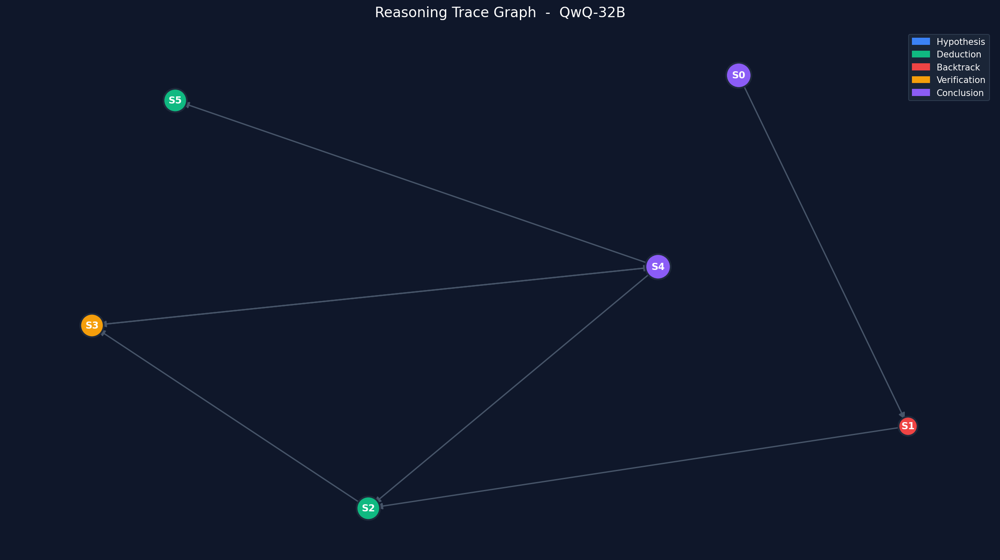
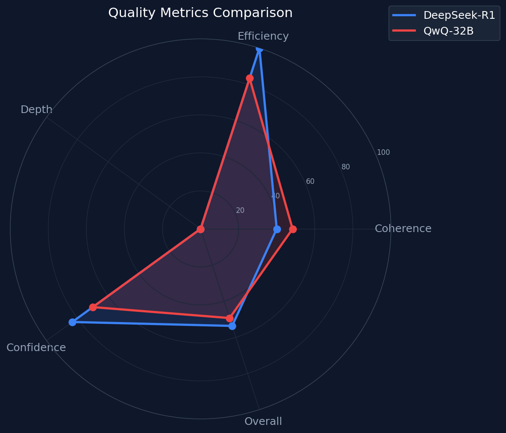
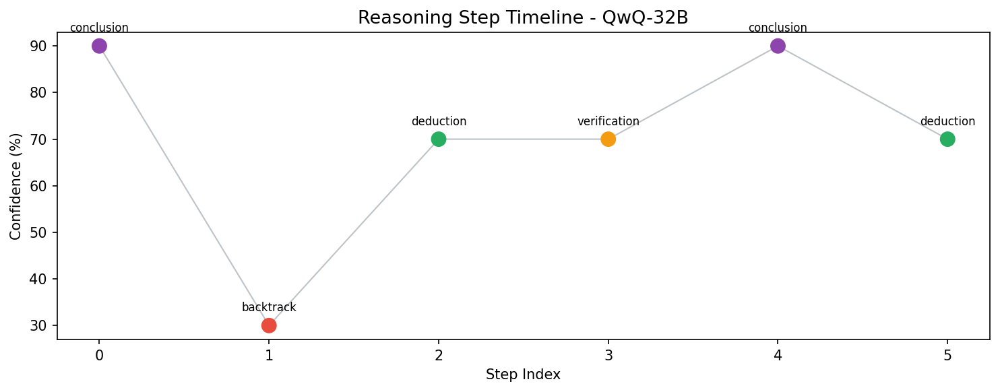
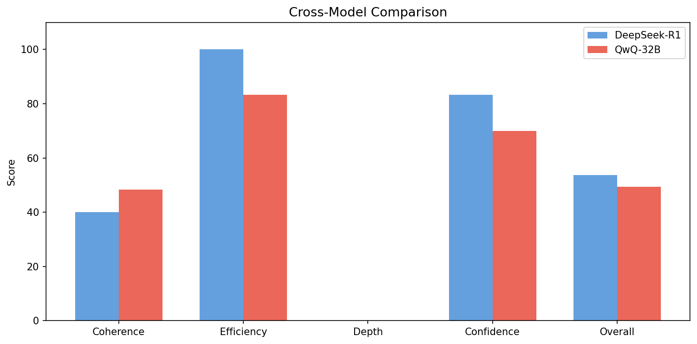
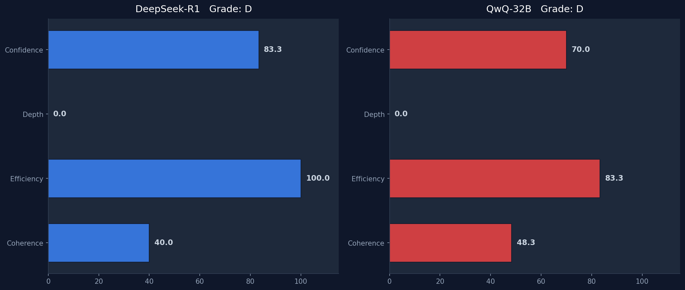

# 🔬 ThinkGraph

### 推理轨迹分析框架

[](https://www.python.org/)
[](LICENSE)
[](tests/)

**将大语言模型的黑盒推理过程转化为可测量、可对比、可优化的数据资产。**

<br>

</div>

---

## 📖 项目简介

ThinkGraph 是一个针对 thinking model（DeepSeek-R1、QwQ-32B、Claude 等）推理轨迹的结构化解析、质量分析与可视化框架。

| | 说明 |
|:---:|:-----|
| **输入** | Thinking Model 的原始输出文本（含 `<think...>` 标签） |
| **输出** | 结构化推理图谱、质量评分报告、可交互可视化图表 |

---

## ✨ 功能特性

| # | 功能 | 说明 |
|:---:|:-----|:-----|
| 1 | **推理轨迹提取** | 自动识别并提取 `<think...>` / `<thinking...>` 标签中的思维链内容 |
| 2 | **语义步骤切分** | 按段落边界、显式编号、转折词等将推理过程分割为有序步骤 |
| 3 | **推理图谱构建** | 检测步骤间逻辑关系（支持/反驳/延伸/回溯/结论），构建有向图 |
| 4 | **质量评分** | 四维评分体系 + A/B/C/D 等级评定 |
| 5 | **交互式可视化** | PyVis 推理树 + Plotly 雷达图/时间线/对比图 |
| 6 | **跨模型对比** | 两个模型的推理输出并排分析 |
| 7 | **命令行 & API** | 完整的 CLI 工具和 Python API 接口 |

---

## 📸 效果展示

<table>
<tr>
<td align="center" width="50%">
<br>
<b>推理轨迹图谱</b>
</td>
<td align="center" width="50%">
<br>
<b>质量指标雷达图</b>
</td>
</tr>
<tr>
<td align="center">
<br>
<b>步骤置信度时间线</b>
</td>
<td align="center">
<br>
<b>跨模型对比</b>
</td>
</tr>
<tr>
<td colspan="2" align="center">
<br>
<b>质量报告卡</b>
</td>
</tr>
</table>

---

## 📊 评分体系

| 指标 | 权重 | 计算方式 | 说明 |
|:----:|:----:|:---------|:-----|
| **连贯性** | 30% | 边数 / 节点数 比值 | 步骤间逻辑连贯程度 |
| **效率** | 25% | 100 - 回溯比例 | 回溯越少效率越高 |
| **深度** | 25% | 最长路径 / 总步骤数 | 推理链的层次深度 |
| **置信度** | 20% | 步骤平均置信度 | 整体确定性水平 |

**等级划分：**

| 等级 | 分数范围 | 含义 |
|:----:|:--------:|:-----|
| **A** | 85 - 100 | 推理质量优秀，逻辑清晰 |
| **B** | 70 - 84 | 整体良好，有少量问题 |
| **C** | 55 - 69 | 可接受，有明显改进空间 |
| **D** | 0 - 54 | 推理质量较差，问题较多 |

---

## 🚀 快速上手

### 安装

```bash
git clone https://github.com/Apageoflove/ThinkGraph.git
cd ThinkGraph
python -m venv venv
source venv/bin/activate        # Windows: venv\Scripts\activate
pip install -e ".[dev,demo]"
```

### Python API（5 行代码）

```python
from thinkgraph import ThinkGraphAnalyzer

analyzer = ThinkGraphAnalyzer()
result = analyzer.analyze(open("response.txt").read(), model_name="deepseek-r1")

print(result.metrics)          # -> {'overall_score': 72.5, 'grade': 'B', ...}
analyzer.visualize(result)     # -> 生成 HTML + PNG 可视化文件
```

### 命令行

```bash
# 分析单个模型
thinkgraph analyze -i response.txt --model deepseek-r1 -o ./output

# 对比两个模型
thinkgraph compare \
  -i r1_output.txt -i qwq_output.txt \
  -n DeepSeek-R1 -n QwQ-32B \
  -q "解方程 x^2 - 5x + 6 = 0"

# JSON 格式输出
thinkgraph analyze -i response.txt --json-output
```

**输出示例：**

```
模型: deepseek-r1
推理步骤数: 3
综合评分: 53.7 (D)

问题:
  - 推理链过浅（深度仅为 0）
  - 缺少验证步骤

优势:
  - 推理过程无回溯，思路清晰
  - 整体置信度较高
```

### Gradio 网页演示

```bash
python demo/app.py
# 浏览器打开 http://localhost:7860
```

粘贴模型输出文本，实时生成推理树和指标面板。

---

## 🏗 架构流程

```
原始模型输出
     │
     ▼
┌──────────────────┐
│  TraceExtractor   │    提取 <think...> 推理块
└────────┬─────────┘
         │
         ▼
┌──────────────────┐
│  StepSegmenter    │    切分为推理步骤列表
└────────┬─────────┘
         │
         ▼
┌──────────────────┐
│ RelationDetector  │    检测步骤间逻辑关系
└────────┬─────────┘
         │
         ▼
┌──────────────────┐
│   GraphBuilder    │    构建 networkx 有向图
└────────┬─────────┘
         │
         ▼
┌──────────────────┐
│  GraphAnalyzer    │    计算图结构特征
└────────┬─────────┘
         │
         ▼
┌──────────────────┐
│  QualityScorer    │    输出质量指标
└────────┬─────────┘
         │
         ▼
┌──────────────────┐
│   Visualizer      │    推理树 + 图表可视化
└──────────────────┘
```

---

## 📁 项目结构

```
ThinkGraph/
├── thinkgraph/                   # 核心代码包
│   ├── parser/                   #   文本解析模块
│   │   ├── trace_extractor.py    #     提取推理块
│   │   ├── step_segmenter.py     #     切分推理步骤
│   │   └── relation_detector.py  #     检测步骤关系
│   ├── graph/                    #   图构建模块
│   │   ├── models.py             #     数据结构定义
│   │   ├── builder.py            #     构建有向图
│   │   └── analyzer.py           #     图结构分析
│   ├── metrics/                  #   评分模块
│   │   ├── quality_scorer.py     #     质量评分
│   │   └── comparator.py         #     模型对比
│   ├── visualizer/               #   可视化模块
│   │   ├── graph_viz.py          #     推理树图
│   │   └── report_viz.py         #     指标图表
│   ├── analyzer.py               #   统一入口
│   └── cli.py                    #   命令行接口
├── demo/
│   └── app.py                    # Gradio 网页演示
├── examples/
│   ├── sample_r1_output.txt      # DeepSeek-R1 示例
│   └── sample_qwq_output.txt     # QwQ-32B 示例
├── tests/                        # 25 个测试用例
├── setup.py
└── requirements.txt
```

---

## 🧪 运行测试

```bash
source venv/bin/activate
pytest tests/ -v

# 预期结果: 25 passed
```

---

## 🔧 技术栈

| 组件 | 技术 |
|:----:|:----:|
| 图数据结构 | [networkx](https://networkx.org/) |
| 交互式推理树 | [pyvis](https://pyvis.readthedocs.io/) |
| 静态图表 | [matplotlib](https://matplotlib.org/) |
| 动态图表 | [plotly](https://plotly.com/python/) |
| 网页演示 | [gradio](https://gradio.app/) |
| 数据处理 | [pandas](https://pandas.pydata.org/) |
| 命令行 | [click](https://click.palletsprojects.com/) |

---

## 🗺 开发计划

- [ ] 支持 streaming 输入实时分析
- [ ] 集成 LLM-as-judge 做更精准的步骤分类
- [ ] 推理质量 benchmark 数据集和排行榜

---

## 📄 许可证

[MIT](LICENSE)